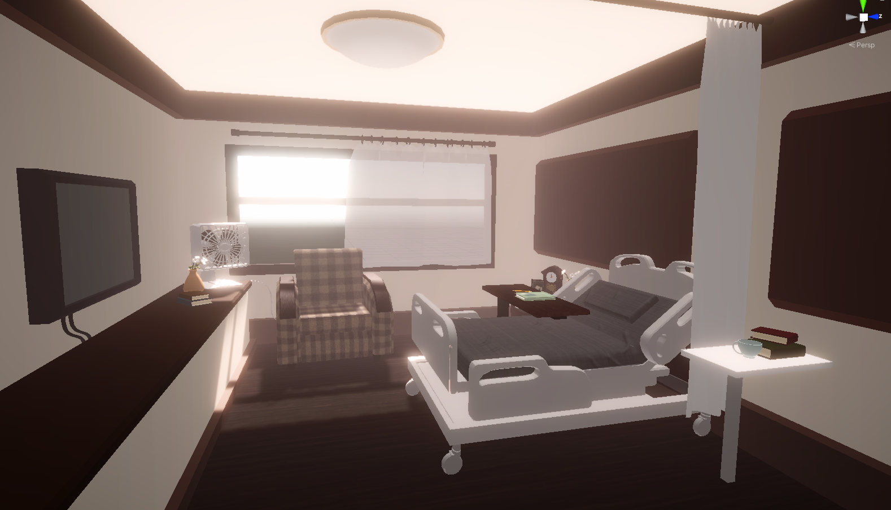

# BVW_Round4: LetMeBeYourEyes

This is a two-week project I made for BVW course at CMU ETC. It is a VR project and was developed on Oculus Rift. The theme of this project is story-telling.

Player would picture a fantasy world to bring light and color back to a blind little girl in the last minutes of your life.

## My contribution to this project
#### Wrote Geomtry Shader to render flowers at runtime

#### Cooperated with another programmer in the team to debug VR control
#### Helped create timeline for story telling
#### Helped the solo artist in the team by writing shaders, including water, skybox, etc

## Click the image to watch the full gameplay video!

